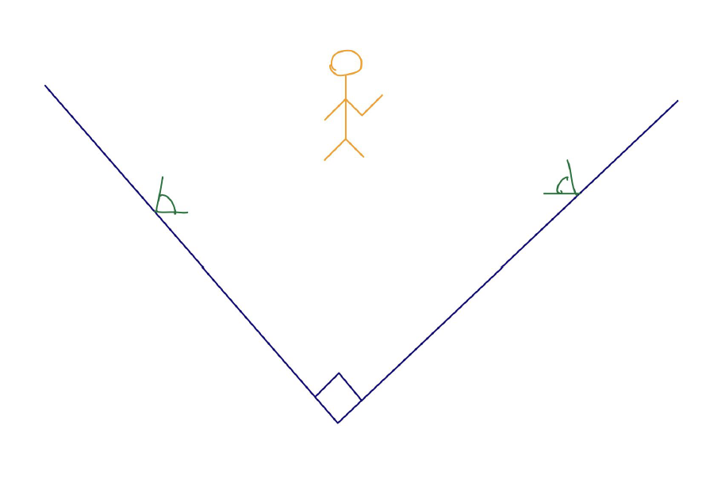

# AI Powered 3D Human Pose Tracking and Analysis

This project uses Pose Detection API ([Posenet](https://blog.tensorflow.org/2018/05/real-time-human-pose-estimation-in.html)/[Movenet](https://blog.tensorflow.org/2021/05/next-generation-pose-detection-with-movenet-and-tensorflowjs.html)) supports multiple models for running real-time pose estimation by simply estimating where key body joints are. Although impressive, the pose is still in 2D.

The main stretch of this project is to create 3D pose and eventually get the 3D pose using [GraphXR](https://www.kineviz.com/) to visualize the data. GraphXR is a browser-based visualization tool that brings unprecedented speed, power, and flexibility to the exploration of data in 2D and XR. 

By positioning two webcams, pointed at orthogonal directions, we can combine the two 2D poses into a single 3D pose stream.

Traditional 3D motion capture systems require a sophisticated setup and are very costly. This system makes 3D pose capture accessible to much more people.

## Clients on ObservableHQ

[ObservableHQ](https://codewithhugo.com/observablehq-notebooks-for-javascript-demos-and-prototypes/) that introduces the notebook paradigm to JavaScript projects. (for those of you familiar with Jupyter notebooks, this is the equivalent with JavaScript instead of Python).

Links:

Stream from webcam 1 | Stream from webcam 2 | Receiver 3D
------------ | ------------- | -------------
Captrures coordinates x, y | Capture coordinates x, y | Combines coordinates into x, y, z
[Webcam 1](https://observablehq.com/@mt-cs/posenet-webcam-1) | [Webcam 2](https://observablehq.com/d/d2b73e086b4f386f) | [Receiver 3D](https://observablehq.com/d/74978e5d2497a671)

    
## Server

Install npm before running index.jx:

       # npm install
       
       # npm install socket.io
       
       # npm install express

This server listens on port 9000

## socket.io

Socket.IO enables real-time bidirectional event-based communication.

   * a index.js server (this repository)

