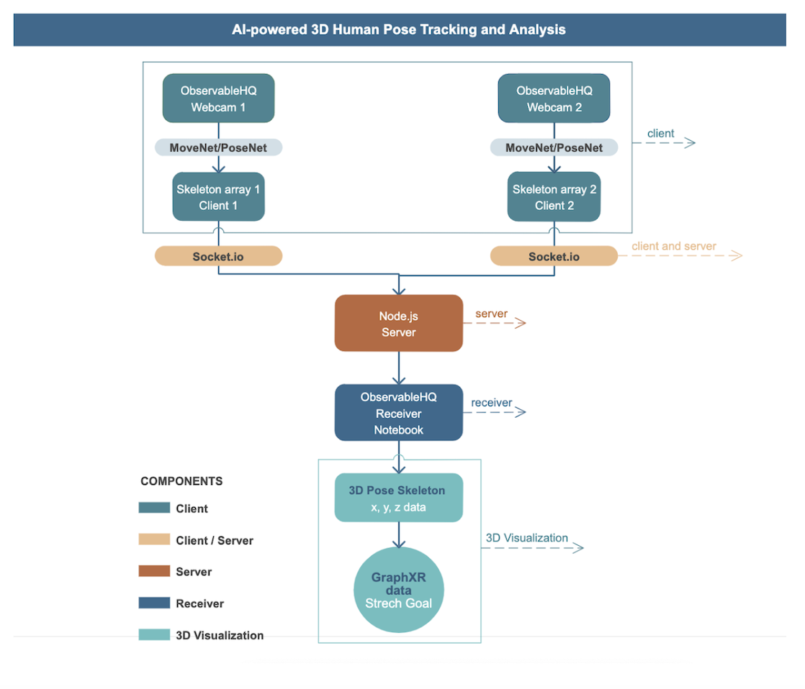
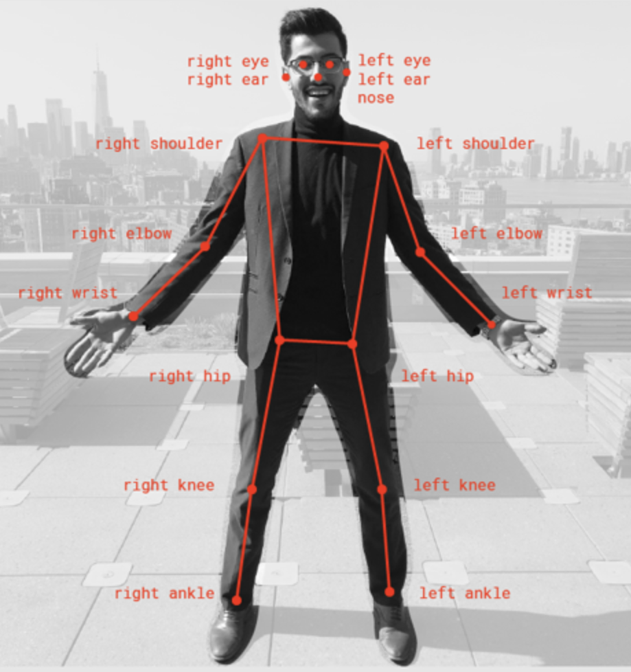

# AI Powered 3D Human Pose Tracking and Analysis

MoveNet: [[Webcam 1](https://observablehq.com/@mt-cs/movenet-3d-pose-tracking-webcam-1)] 
[[Webcam 2](https://observablehq.com/@mt-cs/movenet-3d-pose-tracking-webcam-2)]
[[Receiver](https://observablehq.com/@mt-cs/movenet-3d-pose-tracking-receiver)]

PoseNet: [[Webcam 1](https://observablehq.com/@mt-cs/posenet-webcam-1)] 
[[Webcam 2](https://observablehq.com/@mt-cs/posenet-webcam-2)]
[[Receiver](https://observablehq.com/@mt-cs/posenet-receiver)]

| Webcam 1 | Webcam 2 |
| --- | --- |
|  |  | 

| GraphXR 3D |
| --- |
|  | 

## Table of Contents
  * [Description](#description)
    * [Setup](#setup)
    * [Architectural Diagram](#architectural-diagram)
    * [MoveNet](#movenet)
    * [Client Side](#client-side)
    * [Server Side](#server-side)
  * [Installation](#installation)
  * [Usage](#usage)
  * [Tests](#tests)
  * [GraphXR](#graphXR)
  * [Demo](#demo)
  * [Future Applications](#future-application)
  * [Dependencies](#dependencies)
  * [Credits](#credits)
  * [Acknowledgments](#acknowledgments)
  * [Contact](#contact)

## Description

Whether it's for games, motion analysis in health and fitness, virtual reality development, or medical examinations, many applications require that people and their movements be captured digitally in 3D in real-time. Until now, this was possible only with expensive systems using multiple cameras and/or by having people wear special suits and tracking points or tracking devices. With the AI power of MoveNet and combining multi-device data streams through Socket.io, this project offers the possibility of turn smartphones and webcams into a multi-view body tracking system without using any trackers. We present an affordable solution to detect 3D pose from just using two webcams. The latest development in using deep learning for pose estimation has impressive stability, speed, and tolerance to occlusion. This project uses Pose Detection API ([MoveNet](https://blog.tensorflow.org/2021/05/next-generation-pose-detection-with-movenet-and-tensorflowjs.html)) supports multiple models for running real-time pose estimation by simply estimating where key body joints are. By positioning two webcams, pointed at orthogonal directions, we can combine the two 2D poses into a single 3D pose stream. Traditional 3D motion capture systems require a sophisticated setup and are very costly, hence the multi-webcam system makes 3D pose capture accessible by many more people.
 
The long-term goal of this project is to interact in the VR world without controllers or wearables. By detecting 3D gestures in non-costly ways, we hope to reduce the need for body trackers, hardware usage, and also computational power and make 3D interaction in VR more accessible. Full-body tracking for skeletal animation allows for more user expression that could humanize users in the VR world. There are endless use cases including hand motion interaction with data, video games, and virtual meetings in 3D.

## Setup

Positioning two webcams pointed at orthogonal directions is the simplest way to combine the two 2D poses into a single 3D pose stream. Both cameras are placed at a 90 degrees angle to get the ***x, y, z coordinates*** for plotting in  [Three-dimensional space](https://en.wikipedia.org/wiki/Three-dimensional_space).

*For more information about the proper **camera setup** check [Webcam Notebook](https://observablehq.com/d/823f2f9c4daa588c).*

## Architectural Diagram

 
## MoveNet

[MoveNet Model](https://github.com/tensorflow/tfjs-models/tree/master/pose-detection/src/movenet) is the latest pre-trained machine learning library [released](https://blog.tensorflow.org/2021/05/next-generation-pose-detection-with-movenet-and-tensorflowjs.html) by [TensorFlow](https://www.tensorflow.org) team, as part of a larger [Pose Detection](https://github.com/tensorflow/tfjs-models/tree/master/pose-detection) [TensorFlow.js models](https://www.tensorflow.org/js/models) set. MoveNet is a convolutional neural network model that runs on RGB images and predicts human joint locations of a single person that runs faster than real-time ([30+ FPS](https://blog.tensorflow.org/2021/05/next-generation-pose-detection-with-movenet-and-tensorflowjs.html)).

The [pose Animator](https://blog.tensorflow.org/2020/05/pose-animator-open-source-tool-to-bring-svg-characters-to-life.html) meshes SVG, [face landmarks detection](https://github.com/tensorflow/tfjs-models/tree/master/face-landmarks-detection), and motion capture with [pose estimation](https://www.tensorflow.org/lite/examples/pose_estimation/overview) allows [real-time human pose estimation in the browser](https://medium.com/tensorflow/real-time-human-pose-estimation-in-the-browser-with-tensorflow-js-7dd0bc881cd5).

We encouraged you to check our [2D Webcam Pose Detection With PoseNet](https://observablehq.com/@mt-cs/posenet-webcam-1) to compare the robustness of the two pose detection models. Compared to TensorFlow's older model PoseNet, the [MoveNet model](https://storage.googleapis.com/tfjs-models/demos/pose-detection/index.html?model=movenet) has a powerful combination of speed and accuracy needed that allows an accurate depiction of difficult poses. 

**Although impressive, the pose is still in 2D.** 

For this project, we created a 3D skeleton pose displayed in [GraphXR](https://www.kineviz.com/visualization). GraphXR is a browser-based visualization tool that brings unprecedented speed, power, and flexibility to the exploration of data in 2D and XR. 

**How does MoveNet work**

There are two steps:

* First create a detector by chosing one of the models form SupportedModels, including MoveNet.
    
            const model = poseDetection.SupportedModels.MoveNet;
            const detector = await poseDetection.createDetector(model);
            
* Then you can use the detector to detect poses.
            
            const poses = await detector.estimatePoses(image);

The returned poses list contains detected poses for each individual in the image. For single-person models, there will only be one element in the list. If the model cannot detect any poses, the list will be empty.

For each pose, it contains a confidence score of the pose and an array of keypoints. MoveNet both return *17 keypoints.* 

Each keypoint contains x, y, score and name.

Example output:

        [
          {
            score: 0.8,
            keypoints: [
              {x: 230, y: 220, score: 0.9, name: "nose"},
              {x: 212, y: 190, score: 0.8, name: "left_eye"},
              ...
            ]
          }
        ]

## Client Side

The development of the clients is done on [ObservableHQ](https://observablehq.com/@mt-cs/movenet-3d-pose-tracking-webcam-1). It is the notebook paradigm to JavaScript projects. (for those of you familiar with Jupyter notebooks, this is the [equivalent with JavaScript](https://codewithhugo.com/observablehq-notebooks-for-javascript-demos-and-prototypes/) instead of Python).

There are two notebook webcams that are equivalent to one another, which emit data to the server. The third ObservableHQ notebook is the receiver that takes in both webcams data from the server.

## Links To ObservableHQ Notebooks

Stream from webcam 1 | Stream from webcam 2 | Receiver 3D
------------ | ------------- | -------------
Captrures coordinates x, y | Capture coordinates x, y | Combines coordinates into x, y, z
[Webcam 1](https://observablehq.com/@mt-cs/movenet-3d-pose-tracking-webcam-1) | [Webcam 2](https://observablehq.com/@mt-cs/movenet-3d-pose-tracking-webcam-2) | [Receiver 3D](https://observablehq.com/@mt-cs/movenet-3d-pose-tracking-receiver)

    
## Server Side

Browsers running on multiple devices will be connected using **Socket.IO.**

[Socket.IO](https://socket.io/docs/v4/index.html) is a library that enables real-time, bidirectional, and event-based communication between the browser and the server.

Socket.IO is **NOT** a WebSocket implementation. Although Socket.IO indeed uses WebSocket as a transport when possible, it adds additional metadata to each packet. That is why a WebSocket client will not be able to successfully connect to a Socket.IO server, and a Socket.IO client will not be able to connect to a plain WebSocket server either.

**How does that work?**

The client will try to establish a [WebSocket](https://developer.mozilla.org/en-US/docs/Web/API/WebSocket) connection if possible, and will fall back on HTTP long polling if not.

WebSocket is a communication protocol which provides a full-duplex and low-latency channel between the server and the browser. More information can be found [here](https://en.wikipedia.org/wiki/WebSocket).

Please see the documentation for **socket.io** [here](https://socket.io/docs/v4/index.html)

Socket.io enables real-time bidirectional event-based communication.

-  **index.js** server (this repository)

     * this server listens on port *9000*
     * informs when user gets connected and disconnected
     * broadcast and emits skeleton data to the listening clients

## Installation

Install npm before running index.jx:

        $ npm install
       
        $ npm install socket.io
       
        $ npm install express

        $ npm install --global mocha
    

## Usage

**How to Run it**

The following example attaches socket.io to a plain Node.JS HTTP server listening on port 9000.

Simply run 

        $  node index.js
    
to start the server in the terminal and you should get confirmation response 

   *listening on port 9000* 
   
   
## Tests

**How to Test**

[Mocha](https://mochajs.org/) is a feature-rich JavaScript test framework running on [Node.js](https://nodejs.org/en/) and in the browser, making asynchronous testing simple and fun. Mocha tests run serially, allowing for flexible and accurate reporting, while mapping uncaught exceptions to the correct test cases. Hosted on [GitHub](https://github.com/mochajs/mocha).

To run:

        $ npm test
    
*More information about Mocha you can find [here](https://mochajs.org/)*
   

## GraphXR

[GraphXR](https://www.kineviz.com/) enables graph exploration in virtual reality (VR). Utilizing GraphXR, we display the combined two webcam streams as a 3D skeleton of **nodes** that are connected by **edges** in an interactive virtual 3D graph space, and provides a powerful set of tools to explore and modify the data.

**How to run collected data in GraphXR**

To visualize data in 3D environment, we input CSV files to [Kineviz GraphXR](https://www.kineviz.com/?gclid=CjwKCAjwmK6IBhBqEiwAocMc8gQj_BLHfVHzERnLd8sHldIo0SXmMglRqNBq2CgklB5mUINKPAXDQxoCm38QAvD_BwE).

Follow these steps:

   • Create account on [GraphXR Next](https://graphxrnext.kineviz.com/register)\
   • Download skel.grove and skelly.graphxr from [GitHub](https://github.com/kineviz-3D-human-pose-tracking/streamer-receiver-socketio/tree/main/graphXR) folder\
   • Create new Project in GraphXR Next\
   • Open the recently created project\
   • Click on Project icon on left and then Extensions and pick Grove\
   • Click on View attached files and change into desired .csv data\
   • Drag skelly.graphxr and paste it into the background\
   • Hold right click to rotate the Skeleton as needed\
   • Go to Settings to adjust the visualization\
   • If you want to escape into Virtual Reality World, you can put on your goggles and watch your skeleton in there

  
Watch full Tutorial **[here](https://user-images.githubusercontent.com/55717978/128306293-05b63fce-02df-4850-b2de-71b35a593f3f.mp4)** for more details. 

**Supported Environments**

      WINDOWS, MAC OSX AND LINUX
      
        • The GraphXR client runs best in Google Chrome. Compatibility with other
          browsers may vary
          
      OCULUS RIFT, HTC VIVE AND WINDOWS MIXED REALITY
      
       • The GraphXR client includes Beta support for Virtual Reality (VR) hardware in
         the Google Chrome browser via WebXR.
         
      CLOUD, PRIVATE CLOUD, AND ON-PREMISES DATA HOSTING
      
        • GraphXR Explorer and Analyst editions support local and cloud storage. In
          addition, GraphXR Enterprise is available via on-premises or private cloud
          deployments.
     

*For more information check out [GraphXR User Guide](https://static1.squarespace.com/static/5c58b86e8dfc8c2d0d700050/t/5df2bc684c2e38505cf2be1c/1576189042217/GraphXR_User_Guide_v2_2_1.pdf)*
   

## Demo

## Future Applications

• **Gesture Recognition in the Virtual World**

Using **Machine Learning for Gesture Recognition** and be able to use those gestures in the **Virtual Environment**. Gestures can be mainly used for interactivity with different objects. Most XR is tracking from the glasses so you don't always see your hands, now with the two webcams in the front you do see your hands. So that gives the ability to immerse yourself, whether if you start seeing your hand arms in the virtual environment you actually can integrate the virtual body as if you're real body. Very natural gestures like push, pull, grab, drag can become events to be used in the interactive world. Building the model that can put different things in different places.

## Dependencies

 
  * [tensorflow](https://www.tensorflow.org/)
  * [node.js](https://nodejs.dev/)
  * [npm](https://www.npmjs.com/)
      * [cors](https://www.npmjs.com/package/cors)
      * [express](https://www.npmjs.com/package/express)
      * [socket.io](https://www.npmjs.com/package/socket.io)
      * [husky](https://www.npmjs.com/package/husky)
  * [mocha](https://mochajs.org/)

## Credits

Developed for the [Kineviz](https://kineviz.com/) and [University of San Francisco](https://www.usfca.edu/arts-sciences/graduate-programs/computer-science?gclid=Cj0KCQjwu7OIBhCsARIsALxCUaOnomqGePhLPOYnIdNZNowVP2aSLsepdMYOe9W5Gb3InnI8b5lDKxAaAk03EALw_wcB) Summer Project by:
* [Marisa Tania](https://www.linkedin.com/in/marisatania/)
* [Barbora Novakova](https://www.linkedin.com/in/barbora-novakova-666029126/)

Sponsor: Weidong Yang

Code credits:
* PoseNet: [Loren Riesenfeld](https://observablehq.com/@lorenries/estimating-pose-in-the-browser-with-posenet-and-tensorflow-)
* MoveNet: [Taras Novak](https://observablehq.com/@randomfractals/tensorflow-movenet-webcam)
* Socket.io: [Sylvain Lesage](https://observablehq.com/@severo/hello-socket-io)

## Acknowledgments

We sincerely thank:
* [Weidong Yang](https://www.linkedin.com/in/yangweidong/) and the [Kineviz](https://www.kineviz.com/) Team for our biweekly meetings
* [Nikko Sacramento](https://www.linkedin.com/in/nikkosac/) for plotting the 3D skeleton in GraphXR and running the data in VR
* Sean Li for debugging the cors issue
* [Thom Lauret](https://www.linkedin.com/in/thomlauret/) for the more robust AWS server
* Professor [Mario Lim](https://www.linkedin.com/in/mario-lim-243556/) for helpful crossover network connection discussions
* [Alex Law](https://www.linkedin.com/in/alexandria-law/) for posting the blogpost and voice over
* [Cynthia Yu](https://www.shuhuancynthiayu.com/about) for being our model

## Contact
The code of this repository was implemented by [Barbora Novakova](mailto:barunka838@gmail.com) and [Marisa Tania](mailto:mt.marisatania@gmail.com). Feel free to reach out!
